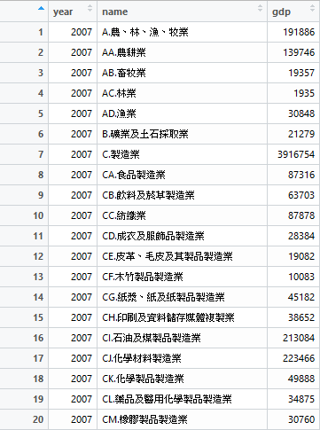
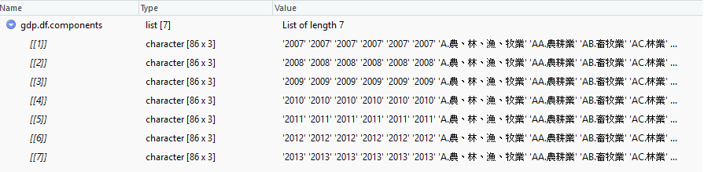

# Digging into Data Type

```R
library(ggplot2)
library(dplyr)
gdp_path <- "C:\\Users\\Jiaaa\\Documents\\R\\win-library\\3.4\\swirl\\Courses\\DataScienceAndR\\Project-ROpenData-Power-GDP\\NA8103A1Ac.csv"
gdp <- file(gdp_path, encoding = "BIG5") %>% readLines

gdp.split <- strsplit(gdp, ",")
year.index <- (sapply(gdp.split, length) == 1) %>% which %>% head(7)

# 開始的index
year.index.start <- year.index
# 全部往後退一位，少一個就拿總長度 = 625這個數值補
year.index.end <- c(tail(year.index, -1), length(gdp.split))

gdp.df.components <- list()

for(i in 1:7) {
  
  start <- year.index.start[i]
  end <- year.index.end[i]

  year <- gdp.split[[start]] %>%
    # 年分資料的字串的奇怪符號，以空白換掉
    gsub(pattern = '"', replacement = '')
  # 喔喔喔以年度的index當作區間～～
  target <- gdp.split[start:end]
 
  target.mat <- do.call(rbind, 
                        target[sapply(target, length) == 3])
  
  target.mat[,1] <- year
  
  target.mat[,2] <- gsub('"', '', target.mat[,2])
 
  gdp.df.components[[i]] <- target.mat
}
gdp.df <- do.call(rbind, gdp.df.components) %>% 
  # 先不把資料轉成factor
  data.frame(stringsAsFactors = FALSE)

colnames(gdp.df) <- c("year", "name", "gdp")

gdp.df$year <- as.integer(gdp.df$year)
gdp.df$name <- as.character(gdp.df$name)
gdp.df$gdp <- as.numeric(gdp.df$gdp)


# 有出警告，中間有值被轉換成NA，過濾NA
gdp.df[is.na(gdp.df$gdp),]
gdp.df <- filter(gdp.df, !is.na(gdp))
```

## Choosing the variables `gdp.df` and `gdp.df.components`.


### `gdp.df` 
**It's `data.frame` type.**
> 


```R
# `data.frame`
# gdp.df[1], gdp.df[2] in the same way
> gdp.df[3]
         gdp
1     191886
2     139746
3      19357
4       1935
5      30848
6      21279
```

How to pick third data which is 19357？
```R
# `numeric`
> gdp.df[3][3,]
[1] 19357

> gdp.df[[3]][3]
[1] 19357
```
>
failed !
```R
> gdp.df[3][,3]
Error in `[.data.frame`(gdp.df[3], , 3) : undefined columns selected
```
>
We have only column.. so the range we chose is safe
```R
# `numeric`
> gdp.df[3][,1]
  [1]   191886   139746    19357     1935    30848    21279
  [7]  3916754    87316    63703    87878    28384    19082
  # ...
> gdp.df[[3]]
  [1]   191886   139746    19357     1935    30848    21279
  [7]  3916754    87316    63703    87878    28384    19082
  # ...
> gdp.df[,3]
  [1]   191886   139746    19357     1935    30848    21279
  [7]  3916754    87316    63703    87878    28384    19082
  # ...
```

```R
# `data.frame`
> gdp.df[1,]
  year               name    gdp
1 2007 A.農、林、漁、牧業 191886
> str(gdp.df[1:3,])
'data.frame':	3 obs. of  3 variables:
 $ year: int  2007 2007 2007
 $ name: chr  "A.農、林、漁、牧業" "AA.農耕業" "AB.畜牧業"
 $ gdp : num  191886 139746 19357
```

## `gdp.df.component`
**It's `list` type.**


##### Preview
```R
> str(gdp.df.components)
List of 7
 $ : chr [1:86, 1:3] "2007" "2007" "2007" "2007" ...
 $ : chr [1:86, 1:3] "2008" "2008" "2008" "2008" ...
 $ : chr [1:86, 1:3] "2009" "2009" "2009" "2009" ...
 $ : chr [1:86, 1:3] "2010" "2010" "2010" "2010" ...
 $ : chr [1:86, 1:3] "2011" "2011" "2011" "2011" ...
 $ : chr [1:86, 1:3] "2012" "2012" "2012" "2012" ...
 $ : chr [1:86, 1:3] "2013" "2013" "2013" "2013" ...
```
> 
Simple !
```R
# `list`
> gdp.df.components[1]
[[1]]
      [,1]   [,2]                                [,3]      
 [1,] "2007" "A.農、林、漁、牧業"                "191886"  
 [2,] "2007" "AA.農耕業"                         "139746"  
 [3,] "2007" "AB.畜牧業"                         "19357"   
 [4,] "2007" "AC.林業"                           "1935"    
 [5,] "2007" "AD.漁業"                           "30848"   
 [6,] "2007" "B.礦業及土石採取業"                "21279"   
```
>
Two ways to extract matrix from a list
```R
# `matrix`
> gdp.df.components[5][[1]]
      [,1]   [,2]                                [,3]      
 [1,] "2011" "A.農、林、漁、牧業"                "245783"  
 [2,] "2011" "AA.農耕業"                         "179167"  
 [3,] "2011" "AB.畜牧業"                         "26704"   
 [4,] "2011" "AC.林業"                           "2018"    
 [5,] "2011" "AD.漁業"                           "37894"   
 [6,] "2011" "B.礦業及土石採取業"                "17174"   

> str(gdp.df.components[4][[1]])
 chr [1:86, 1:3] "2010" "2010" "2010" "2010" "2010" "2010" ...
> str(gdp.df.components[[4]])
 chr [1:86, 1:3] "2010" "2010" "2010" "2010" "2010" "2010" "2010" "2010" "2010" "2010" ...
 
> gdp.df.components[[4]]
      [,1]   [,2]                                [,3]      
 [1,] "2010" "A.農、林、漁、牧業"                "224828"  
 [2,] "2010" "AA.農耕業"                         "158291"  
 [3,] "2010" "AB.畜牧業"                         "30160"   
 [4,] "2010" "AC.林業"                           "1604"    
 [5,] "2010" "AD.漁業"                           "34773"   
 [6,] "2010" "B.礦業及土石採取業"                "18415"   
```
In the martix, we can use `[row, col]` method to take what we want.  

```R
# `character`
> gdp.df.components[[4]][1,]
[1] "2010"               "A.農、林、漁、牧業"
[3] "224828"
> gdp.df.components[[4]][1,3]
[1] "224828"
> gdp.df.components[[4]][173]
[1] "224828"

> gdp.df.components[5][[1]][1]
[1] "2011"
> gdp.df.components[5][[1]][87]
# gdp.df.components[[5]][87]
[1] "A.農、林、漁、牧業"

# the last one in 86 * 3 matrix
# gdp.df.components[[5]][258]
> gdp.df.components[5][[1]][258]
[1] "2128517"
 
```

# Convert matrix to data.frame

```R
class(gdp.df.components[[5]])
[1] "matrix"
```
## Here
```R
data.frame(gdp.df.components[[5]])
     X1                                X2       X3
1  2011                A.農、林、漁、牧業   245783
2  2011                         AA.農耕業   179167
3  2011                         AB.畜牧業    26704
4  2011                           AC.林業     2018
5  2011                           AD.漁業    37894
6  2011                B.礦業及土石採取業    17174
7  2011                          C.製造業  4102225
8  2011                     CA.食品製造業   101013
9  2011               CB.飲料及菸草製造業    77935
10 2011                         CC.紡織業    85560
11 2011             CD.成衣及服飾品製造業    29456
12 2011       CE.皮革、毛皮及其製品製造業    18186
13 2011                 CF.木竹製品製造業    10135
14 2011         CG.紙漿、紙及紙製品製造業    48508
15 2011       CH.印刷及資料儲存媒體複製業    40372
16 2011             CI.石油及煤製品製造業   130368
17 2011                 CJ.化學材料製造業   287801
18 2011                 CK.化學製品製造業    61091
19 2011       CL.藥品及醫用化學製品製造業    38405
20 2011                 CM.橡膠製品製造業    32740
21 2011                 CN.塑膠製品製造業    94483
22 2011           CO.非金屬礦物製品製造業   136613
23 2011                 CP.基本金屬製造業   235974
24 2011                 CQ.金屬製品製造業   249925
25 2011               CR.電子零組件製造業  1204200
26 2011 CS.電腦、電子產品及光學製品製造業   578411
27 2011                 CT.電力設備製造業   127359
28 2011                 CU.機械設備製造業   207010
29 2011             CV.汽車及其零件製造業   113953
30 2011     CW.其他運輸工具及其零件製造業    79200
31 2011                     CX.家具製造業    14493
32 2011                     CY.其他製造業    99034
33 2011                D.電力及燃氣供應業   126013
34 2011                     DA.電力供應業   127281
35 2011                 DB.氣體燃料供應業    -1268
36 2011            E.用水供應及污染整治業    96943
37 2011                     EA.用水供應業    22493
38 2011                     EB.污染整治業    74450
39 2011                          F.營造業   383053
40 2011                    G.批發及零售業  2443613
41 2011                         GA.批發業  1511666
42 2011                         GB.零售業   931947
43 2011                    H.運輸及倉儲業   398441
44 2011                     HA.陸上運輸業   181031
45 2011                     HB.水上運輸業    10148
46 2011                     HC.航空運輸業    49871
47 2011               HD.運輸輔助及倉儲業   125636
48 2011                   HE.郵政及快遞業    31755
49 2011                    I.住宿及餐飲業   329048
50 2011                      IA住宿服務業    54938
51 2011                         IB.餐飲業   274110
52 2011                J.資訊及通訊傳播業   461781
53 2011                         JA.傳播業   115875
54 2011                         JB.電信業   223480
55 2011                         JC.資訊業   122426
56 2011                    K.金融及保險業   915039
57 2011                     KA.金融中介業   568368
58 2011                         KB.保險業   238048
59 2011           KC.證券期貨及其他金融業   108623
60 2011              L.不動產及住宅服務業  1211679
61 2011                       LA.不動產業   207872
62 2011                       LB.住宅服務  1003807
63 2011          M.專業、科學及技術服務業   314750
64 2011                      N.支援服務業   204890
65 2011                         NA.租賃業    43242
66 2011                 NB.其他支援服務業   161648
67 2011  O.公共行政及國防；強制性社會安全  1054319
68 2011                      P.教育服務業   667152
69 2011        Q.醫療保健及社會工作服務業   410855
70 2011                 QA.醫療保健服務業   379423
71 2011                 QB.社會工作服務業    31432
72 2011          R.藝術、娛樂及休閒服務業   123269
73 2011                      S.其他服務業   379268
74 2011           SA.宗教、職業及類似組織    60436
75 2011                     SB.家事服務業   101345
76 2011               SC.未分類其他服務業   217487
77 2011                             合 計 13885295
78 2011                            進口稅   162751
79 2011                      加值型營業稅   264154
80 2011                     總 計(生產面) 14312200
81 2011                          統計差異        -
82 2011                               GDP 14312200
83 2011                 按三級產業分:農業   245783
84 2011                 按三級產業分:工業  4725408
85 2011               按三級產業分:服務業  9341009
86 2011                  補充項目:ICT產業  2128517
```
## Check
```R
class(data.frame(gdp.df.components[[5]]))
[1] "data.frame"
```
